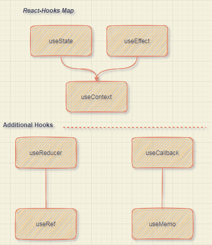

# Example for React Hooks Guideline
actual implementation react-hooks (commented in indonesian) with simplified example code snippet

## Big Thanks to Freecode Camp lesson & EpicReact.dev course

### More on Codesandbox :
links

### Map

## Index

#### useState

- Reminder

#### useEffect and Conditional Rendering

- Tours
- Reviews
- Accordion
- Menu
- Tabs
- Slider

#### Forms

- Lorem Ipsum Generator
- Color Shades Generator
- Grocery Bud

#### useRef

- Navbar

#### useContext

- Modal and Sidebar
- Stripe Menus

#### useReducer and useContext

- Cart

#### React Router

- Routing

## TO DO

- Storybook JS for actual component
- improve code guideline indonesian
